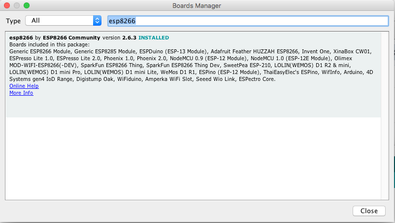

# Sensor Node

## Requirements

### Hardware Requirements
* ESP8266 WEMOS D1
* DHT22 Sensor
* Bread Board
* Wires to connect ESP to Circuit Board
* USB power cable to connect to ESP

### Software Requirements
* [Arduino IDE](https://www.arduino.cc/en/Main/Software)

##### Arduino Installing WEMOS ESP8266 Drivers with Boards Manager
In order to use the WEMOS board you must first install the appropriate drivers for your ardion IDE.  
The following instructions are from https://github.com/esp8266/Arduino.

Starting with Arduino 1.6.4, installation of third-party platform packages is done using Boards Manager. There are packages available for Windows, Mac OS, and Linux (32 and 64 bit).

 

Install the current upstream Arduino IDE at the 1.8.7 level or later. The current version is on the Arduino website.
Start Arduino and open the Preferences window.
Enter https://arduino.esp8266.com/stable/package_esp8266com_index.json into the Additional Board Manager URLs field. You can add multiple URLs, separating them with commas.

Open Boards Manager from Tools > Board menu and install esp8266 platform (and don't forget to select your ESP8266 board from Tools > Board menu after installation).

## Getting The Sensors Up And Running

#### Arduino prerequisites
1. Install Library - PubSubClient by Nick O'Leary Version 2.7.0 
2. Install Library -  

#### WEMOS D1

1. Connect the DHT22 to your ESP.  
 

3. Copy and paste [firmware](https://gitlab.com/german.martinez/black-forest-firmware/blob/master/DHT22Esp.ino) into your Arduino IDE.

[this tutorial](https://randomnerdtutorials.com/esp8266-dht11dht22-temperature-and-humidity-web-server-with-arduino-ide/). You only need to follows the directions under the headers "ESP8266 and DHT11/DHT22 Schematic Diagram" and "Installing the DHT Library for ESP8266".
2. Copy and paste [firmware](https://gitlab.com/german.martinez/black-forest-firmware/blob/master/DHT22Esp.ino) into your Arduino IDE.
3. In lines 15 and 16, change the ssid and password to match your wifi ssid/name and your wifi password.
4. Click the upload button.
5. You should see debug statements in the terminal letting you know that the ESP has connected to your wifi.
