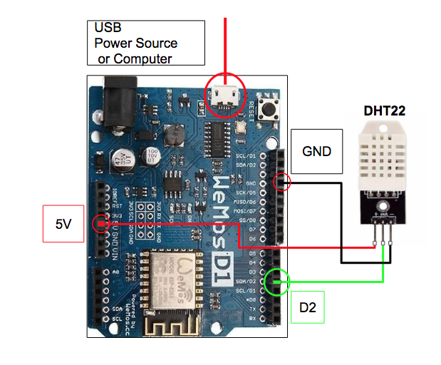
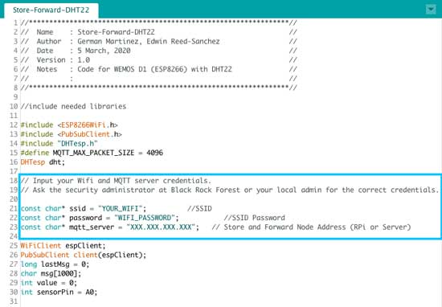
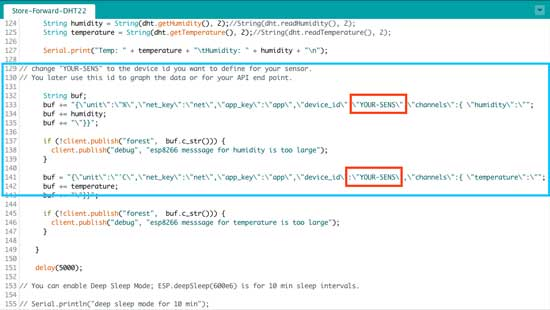

# Sensor Node

## Requirements

### Hardware Requirements
* ESP8266 WEMOS D1
* DHT22 Sensor
* Bread Board
* Wires to connect ESP to Circuit Board
* USB power cable to connect to ESP

### Software Requirements
* [Arduino IDE](https://www.arduino.cc/en/Main/Software)

### Arduino Drivers and Libraries

#### WEMOS ESP8266 Drivers 

In order to use the WEMOS board you must first install the appropriate drivers for your Arduino IDE.  
The following instructions are from https://github.com/esp8266/Arduino.

Starting with Arduino 1.6.4, installation of third-party platform packages is done using Boards Manager. There are packages available for Windows, Mac OS, and Linux (32 and 64 bit).

 

Install the current Arduino IDE 1.8.7 or later.
Start Arduino and open the Preferences window. Enter https://arduino.esp8266.com/stable/package_esp8266com_index.json into the Additional Board Manager URLs field. You can add multiple URLs, separating them with commas.

Open Boards Manager from Tools > Board menu and install esp8266 platform.
Check to see if you have your ESP8266 board from Tools > Board menu after installation.

#### Arduino Libraries
- Open tools menu and open "Manage Libraries"
- Search for Pubsubclient, pick the one by Nick O'Leary, and install version 2.7.0
- Search for DHT Sensor Library for ESPx, pick the one by beegee_tokyo and install version 1.17.0

## Get the Sensors Up And Running
#### WEMOS D1

1. Connect the DHT22 to your WEMOS D1.  
 

2. Pick (LOLIN)WEMOS D1 R2 & Mini from Tools > Board menu.

3. Copy and paste [firmware](https://github.com/saycel/black-rock-forest-store-and-forward/blob/documentation/firmware/Store-Forward-DHT22/Store-Forward-DHT22.ino) into your Arduino IDE.

4. On line 21, 22, update the credentials for your wifi network, wifi password. Note this WEMOS board only connects to2.4GHz Wifi.  For Black Rock Forest users ask security officer for the correct credentials. 

5. On line 23, update the location of your MQTT server.  This can be the local Store and Forward Node Raspberry Pi, or the central server.  For Black Rock Forest users ask security officer for the correct credentials. 

 

6. On line 133 and 141 change "YOUR-SENS" to the name you wouldl like to use for your sensor.  Keep the name to less than 8 characters to save memory.  You will later use this name to visualize your data or for your API calls.  

 

7. Optionally you can also set the WEMOS to go into deep sleep mode and wake up every 10 minites. To do this uncomment lines 155 and 156 

8. Set Tools> upload speed to 115200.  

9. Upload Firmware.

10. Open up your serial monitor.  
Here you can see if the WEMOS is connecting to your wifi, and if the sensor is properly connected and sending data. you will also see a stream of temperature and humidity data. 

11. Continue to [Grafana Store and Forward Guide](https://github.com/saycel/black-rock-forest-store-and-forward/blob/documentation/docs/grafana.md) to learn how to visulize data.  
