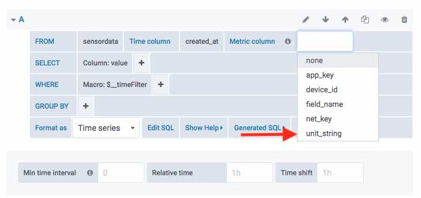
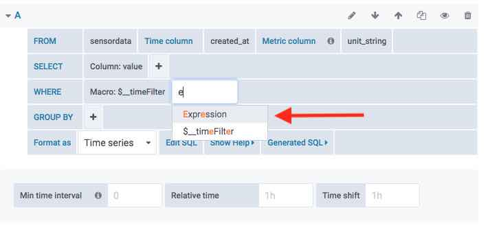
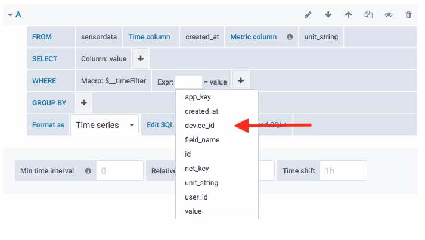
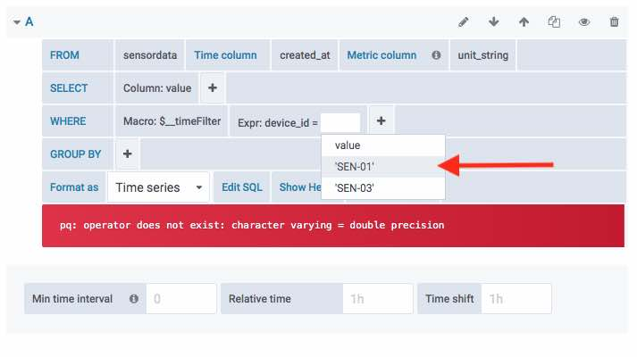
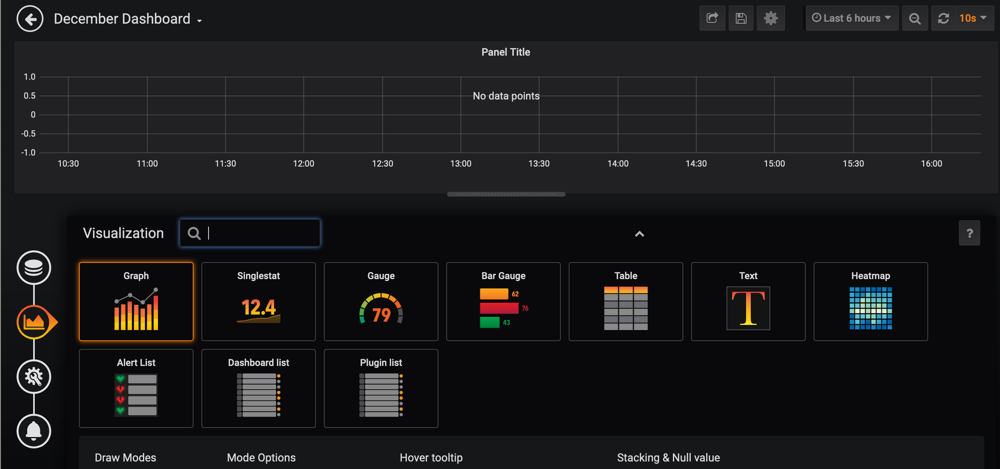
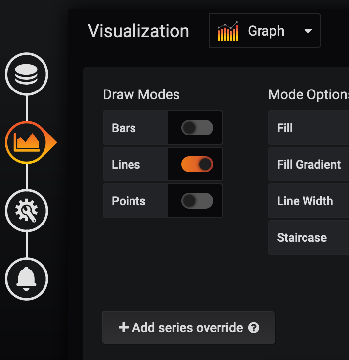

// Add red arrows to images where buttons or text is placed. 

### Grafana
Grafana is a multi-platform open source analytics and interactive visualization software. It provides charts, graphs, and alerts. Grafana is currently part of the installation package included in this repository. 

### Access Grafana
Access Grafana thorugh the IP address where you installed the Store and Forward node software.  The Black Rock Forest you can http://165.22.191.125:3000/ 

You will need a login and Password. Ask Black Rock Forest security advisor for your credentials. 

### How To Add A sensor to a Grafana Panel
Follow [Sensor Node Guide](./docs/esp8266.md) to make a ESP8266 sensor node.  
On line 133 and 141 of the firmware code you changed "YOUR-SENS" to your own name for the sensor. For this example we will give it the name "SEN-001" 

#### Step 1:
Login into Grafana

#### Step 2:
On the upper left hand corner roll over "+" sign and click on dashboard. 
This will allow you to create your own Dashboard where you can add several panels that will display your sensor data.  

#### Step 3:
Click on disk icon to save dashbard. 

#### Step 4:
On the save popup change the name of your dashboard.  For this example I will change it to "Science Center Sensor Dashboard".  click "save". It is a good idea to give your dashboard a descriptive name, so you can refer to it quickly when you want to access your sensor visualizations.  For example I may have sensor near Science center, and other sensor at Mt. Misery.  I could create different dashboards for each location, or I could create a dashboard that has both Science Center and Mt. Misery Sensors and I migh called this Dashboard based on the experiment I am conducting like "Black Rock Forest Temperature and Humidity Dashboard"

#### Step 4:
Once you make your first dashboard you will see a default panel.  Click on the "Panel title" and in the drop down click "edit". 

#### Step 5:
You may see a graph, ignore this information and further down edit information in the "Query" section

#### Step 6:
Click on the box to the right of Metric Column and pick "unit string".  If nothing appears in the dropdown press the letter "u" and it should appear.  

#### Step 7:
Click on the box to the right of "Macro..." and pick "expression".  If nothing appears in the dropdown press the letter "e" and it should appear.  

#### Step 8:
Click on the "+" sign to the right of "Macro..." and pick "expression".  If nothing appears in the dropdown press the letter "e" and it should appear.  

#### Step 9:
Click on the first "value" next to "Expr:" and choose "device_id". 

and right of the page, click "Add Panel".

Step 2:

A panel titled 'New Panel' will appear. Click 'Choose Visualization'.

Step 3:

Choose 'Graph'.

Step 4:

After choosing graph, you will click the three disks on the upper left of this screenshot. This is where you'll set the database query.

Step 5:

In the top row, named 'From', change 'Metric column' to 'unit_string'.

Step 6:

In the third row, named 'Where', click the plus sign then click 'Expression'.

Step 7:

In the same row, named 'Where', change the expression to match your query. In this instance we are searching a device id named 'dendro6'.

Step 8:

Now click the settings icon on the far right. Here you can change the name of your panel.

Step 9:

Finally, go back to your dashboard to see your new Panel.

