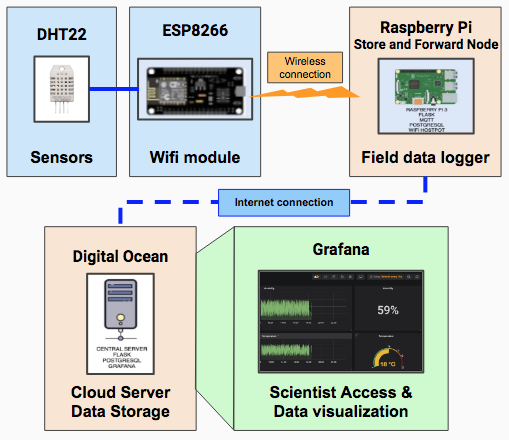

# Black Rock Forest Store and Forward Node Project

The Black Rock Forest Store and Forward Node Project is a solution to provide network data loggers for enviornmental sensors in conjunction with the Black Rock Forest Wifi Mesh network.  

The Store and Forward nodes are data logging Raspberry Pi based servers located in the forest. The Store and Forward nodes record sensor data, store it locally, and passes it along to each node in the network until it arrives at the Central Store and Forward server in the cloud. Current configurations recieve sensor data from ESP8266 based WIFI chips, but can be used by any 802.11 based Wifi microcontroller or shield.  For this documentation the ESP8266 sensor nodes use a DHT22 temperature and humidity sensors.  

All of our testing has been done with:

- ESP8266 - WEMOS D2 
- DHT22 Temperature and Humidity Sensor
- Raspberry Pi 3B+ 
- Ubuntu 18.04
- Grafana 6.3.3
- Server - Digital Ocean Droplet

## Understanding the Architecture

The Store and Forward node system is made up of 5 components:
- 1 - DHT22 Teperature and Humidity Sensor
- 2 - ESP8266 Microcontroller (WEMOS D1) 
- 3 - Raspberry Pi with Store and Forward Node Software 
- 4 - Cloud Server with Store and Forward Node Software
- 5 - Grafana Visualizaion software

At one end of the network, are one or more sensors. Those sensors can connect to a Raspberry Pi Store and Forward Nodes located on the same Local Area Network (LAN) in the Forest; or they can connect dirrectly to the cloud based Store and Forward Server if the sensor is connected to the internet.  For the Sensor nodes that send data to the local Rasperrby Pi Store and Foward Node, the data is saved localy and forwarded on to the Cloud Store and Forward Server. The data is then avaliable to be visualized using Grafana via the public website: http://165.22.191.125:3000/

It is important to note that each of these layers are completely decoupled. They work via message passing. You don't need to use the sensors we used, nor a Raspberry Pi, or even Digital Ocean. Any device that's at least as powerful as a Raspberry Pi 3 can host this code and serve as a store and forward node. Any digital sensor connected to a microcontroller with Wifi or 802.11 capabilities can can send data to the store and forward nodes.

## Getting Started: Hardware and Server

### DHT22 

A DHT22 is a basic, low-cost digital temperature and humidity sensor. It uses capacitive humidity sensor and a thermistor to measure the surrounding air, and outputs a digital signal on the data pin (no analog input pins needed). [DHT22 is avaliable at adafruit.](https://www.adafruit.com/product/385)

### ESP8266 
The ESP8266 is a low-cost Wi-Fi microchip with full TCP/IP stack and microcontroller capability that can be programed using Arduino IDE. It comes in several flavors, and for this project we used the WEMOS D1

| **WEMOS D1**      | **WEMOS D1 Mini Pro (with external antenna)** | **NODEMCU**   |
| ------------- |:-------------:| -----:|
|  |       |   |

[More information on ESP8266](http://esp8266.net/).

### Raspberry Pi

The Raspberry Pi is a small single-board computer where the store and forward node software is installed. Store and Forward nodes ar placed at each major wifi access point in the forest, and act as the local data logger for sensor nodes.  
[More information on Raspberry Pi](https://www.raspberrypi.org/)

### Digital Ocean

Digital Ocean is the cload infrastructure we use for the deployment of the Store and Forward Cloud service which includes Grafana.  This software can be installed on a digital ocean droplet, or on anu other cloud or local server.  

[Digital Ocean](https://www.digitalocean.com/)

### How To Guides
The how to guides are broken down into 3 major componenets of the Store and Forward Node system. 

[Sensor Guide](./docs/esp8266.md) The Sensor guide has instructions on how to use WEMOS D1 ESP8266 microcontroller and a DHT22 and connect them to a Store and Forward network.  

[Main App Guide](./docs/main_app.md) Is a step by step instructions for setting up as a store and forward server on either a Raspberry Pi or a Cloud based server.

[Grafana Store and Forward Guide](./docs/grafana.md) provides instructions for visualizing data from Sensors on a Grafana, an open source visulaization platform.  

### FAQ & Troubleshooting
[FAQ and troubleshooting](./docs/faq-troubleshooting.md) will provide users answers to common questions, and ways to debug the Store and Forward system.  

